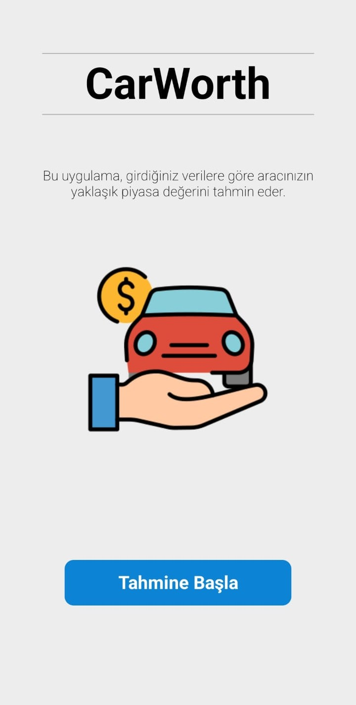
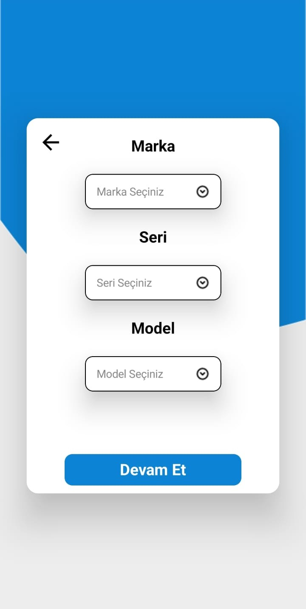
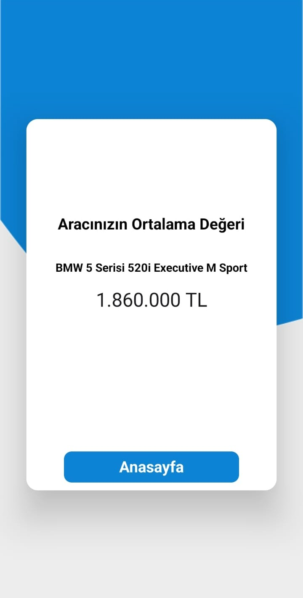
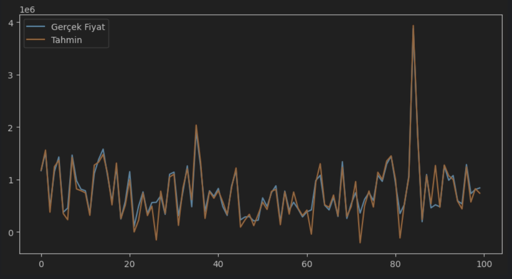

Bu proje, Kotlin Jetpack Compose ile geliştirilmiş bir mobil uygulama ve Python’da CatBoost ile eğitilmiş arac fiyat tahmini modelini içerir.

Kullanılan Teknolojiler
Frontend: Kotlin, Jetpack Compose
Veri Toplama: BeautifulSoup (Web scraping)
Veri İşleme: Pandas (Veri temizleme ve manipülasyon)
Makine Öğrenimi: CatBoost (Model eğitimi ve tahmin)
Backend API: FastAPI (Python web framework)
İletişim: HTTP istekleri (Kotlin'den Python API'sine)

  
  
  
  

