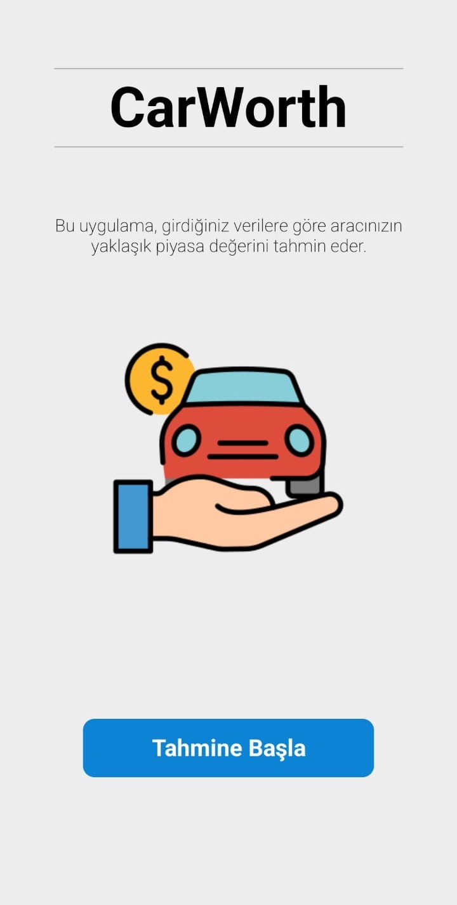
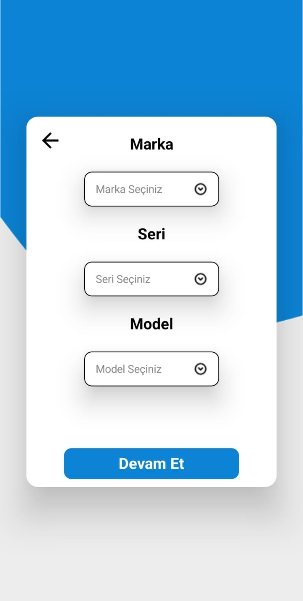

Bu proje, Kotlin Jetpack Compose ile geliştirilmiş bir mobil uygulama ve Python’da CatBoost ile eğitilmiş arac fiyat tahmini modelini içerir.

Frontend: Kotlin, Jetpack Compose

Veri Toplama: BeautifulSoup (Web scraping)

Veri İşleme: Pandas (Veri temizleme ve manipülasyon)

Makine Öğrenimi: CatBoost (Model eğitimi ve tahmin)

Backend API: FastAPI (Python web framework)

İletişim: HTTP istekleri (Kotlin'den Python API'sine)

  
  
  

